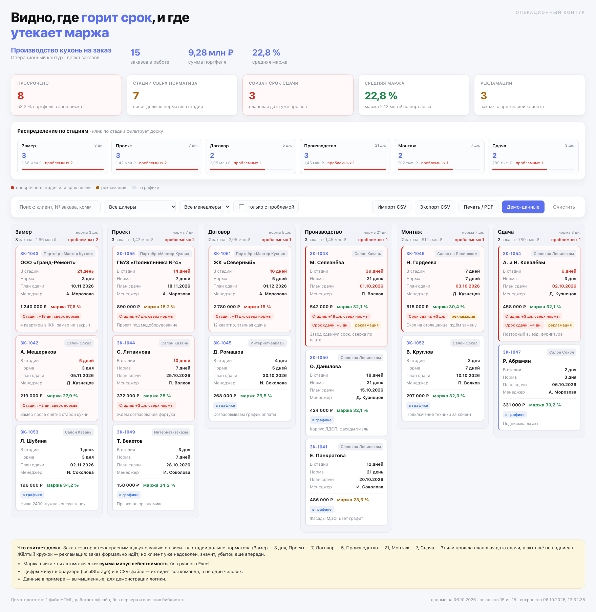
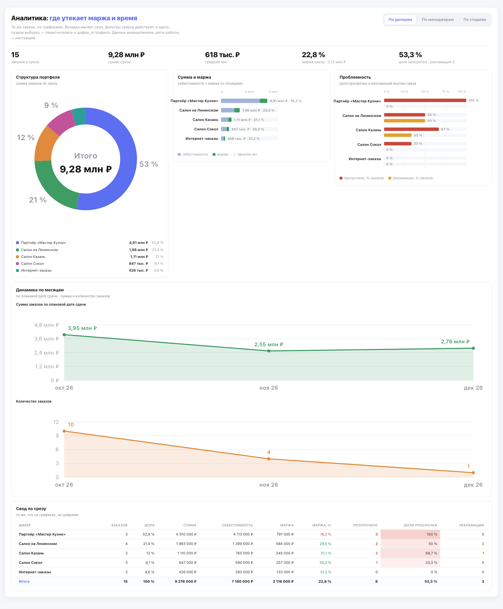

# Тестовое задание · Операционный директор на аутсорсе

Материалы к заданию: план первых трёх месяцев и рабочий мини-инструмент, который я собрал с ИИ.

## Живая версия инструмента

**Доска заказов:** https://petrobond.github.io/test-jobs/Systematica/case_operational_director/tool/

Готовые срезы ссылкой (можно отправлять как есть):

- только проблемные заказы — [`?hot=1`](https://petrobond.github.io/test-jobs/Systematica/case_operational_director/tool/?hot=1)
- срез по дилеру — [`?dealer=Салон Казань`](https://petrobond.github.io/test-jobs/Systematica/case_operational_director/tool/?dealer=%D0%A1%D0%B0%D0%BB%D0%BE%D0%BD%20%D0%9A%D0%B0%D0%B7%D0%B0%D0%BD%D1%8C)
- аналитика по менеджерам — [`?bi=manager`](https://petrobond.github.io/test-jobs/Systematica/case_operational_director/tool/?bi=manager)

Скриншоты — в папке [`screenshots/`](screenshots/), если удобнее смотреть картинками.

## Что в папке



| Файл | Что это |
|---|---|
| [`part1.md`](part1.md) · [`part1.pdf`](part1.pdf) | Часть 1. План первых трёх месяцев (одна страница) |
| [`part2.md`](part2.md) · [`part2.pdf`](part2.pdf) | Часть 2. Мини-инструмент и история сборки (два абзаца) |
| [`tool/index.html`](tool/index.html) | Сам инструмент: один файл, работает офлайн, без сервера и библиотек |
| [`tool/sample_orders.csv`](tool/sample_orders.csv) | Демо-данные: 15 вымышленных заказов по всем стадиям |
| [`tool/selfcheck.js`](tool/selfcheck.js) | Автотест расчётов и разбора CSV (60 проверок) |
| `screenshots/` | Скриншоты доски (общий вид, «только с проблемой», срез по дилеру) и блока аналитики |

## Аналитика



Ниже доски — блок «Аналитика: где утекает маржа и время». Те же данные, но графиками: структура
портфеля кольцом с суммами и долями, сумма и маржа по позициям (себестоимость + маржа), доля
просрочки и рекламаций внутри среза, динамика суммы и количества заказов по месяцам и свод-таблица
с цветовой подсветкой проблемных строк. Вкладки переключают срез — по дилерам, по менеджерам, по
стадиям; фильтры сверху пересчитывают и графики, и таблицу. Всё нарисовано вручную в SVG: внешних
библиотек нет, страница по-прежнему один файл и работает офлайн. Второй скриншот —
[`screenshots/bi_managers.png`](screenshots/bi_managers.png) (срез по менеджерам).

## Как открыть инструмент

Скачайте `tool/index.html` и откройте двойным щелчком в браузере — больше ничего не нужно.
Внутри уже есть демо-данные; свои заказы можно загрузить кнопкой **«Импорт CSV»**. Сразу под доской —
блок аналитики с графиками и вкладками «По дилерам / По менеджерам / По стадиям».

## Автотест

```bash
cd tool && node selfcheck.js
```

Скрипт берёт расчётное ядро прямо из `index.html` и проверяет на демо-данных и на «чужом» CSV:
просрочки по стадиям, сорванные сроки, маржу, распределение по стадиям, фильтры, round-trip
экспорта-импорта, а также срезы для аналитики (агрегаты по дилерам, менеджерам, стадиям, динамику по
месяцам, средний чек и проценты на графиках). Все проверки должны закончиться выводом
`ВСЕ ПРОВЕРКИ ПРОЙДЕНЫ`.

## Как пересобрать PDF

```bash
./build_pdf.sh      # требует pandoc и Google Chrome
```

## Как пересобрать скриншоты

```bash
./shots.sh          # требует Google Chrome и python3 с Pillow
```
