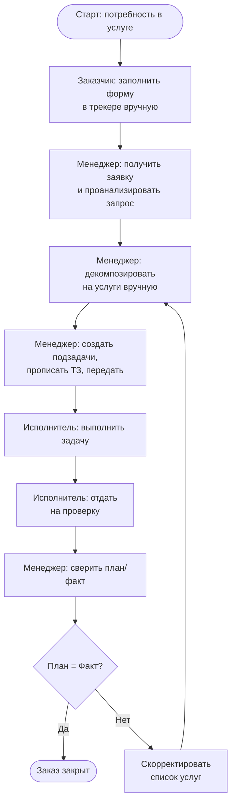

# 🏗️ Моделирование процесса «Обработка заказа»

> Тестовое задание: анализ, BPMN-схема и модель улучшения процесса обработки заказа.

---

## 1. BPMN-диаграмма текущего процесса (AS-IS)

**Интерактивная BPMN 2.0-диаграмма:** [открыть в браузере](https://petrobond.github.io/test-jobs/yandex-opt-manager/)


Ниже — текстовое описание процесса в виде дорожек (swimlanes):

### Дорожка «Заказчик»

| Шаг | Действие | Тип задачи |
|-----|----------|------------|
| 1 | Заполняет форму заказа в трекере вручную | Manual |

### Дорожка «Менеджер»

| Шаг | Действие | Тип задачи |
|-----|----------|------------|
| 2 | Получает заявку и анализирует запрос | User |
| 3 | Декомпозирует описание на услуги вручную, заполняет перечень | User |
| 4 | Создаёт подзадачи, прописывает ТЗ, передаёт исполнителям | User |
| 7 | Сверяет план/факт | User |
| 8 | Принимает решение: **закрыть задачу** либо **скорректировать список услуг** (⟲ возврат к шагу 3) | Gateway |

### Дорожка «Исполнитель»

| Шаг | Действие | Тип задачи |
|-----|----------|------------|
| 5 | Выполняет задачу | User |
| 6 | Отдаёт результат на проверку менеджеру | User |

### Граф процесса (Mermaid)



---

## 2. Анализ узких мест

### 2.1. Сводная таблица проблем

| № | Узкое место | Тип проблемы | Потери времени (оценка) | Серьёзность |
|---|-------------|-------------|------------------------|-------------|
| 1 | **Ручное заполнение формы заказчиком** | Ошибки ввода, неполнота данных, отсутствие валидации | 15–25% времени заказчика | 🔴 Высокая |
| 2 | **Ручная декомпозиция на услуги** | Менеджер вручную «разбирает» заказ — нет шаблонов, нет автоматизации | 20–30% времени менеджера | 🔴 Высокая |
| 3 | **Ручное создание подзадач + ТЗ** | Менеджер вручную пишет ТЗ для каждой подзадачи; дублирование информации | 15–20% времени менеджера | 🟡 Средняя |
| 4 | **Цикл «корректировка → передекомпозиция»** | При несовпадении план/факт — полный возврат к шагу 3; нет частичных правок | 10–25% от всех заказов проходят цикл повторно | 🔴 Высокая |
| 5 | **Отсутствие SLA и автоматического мониторинга** | Нет прозрачности статуса; менеджер не видит прогресс без ручного контроля | 5–10% на статус-встречи и уточнения | 🟡 Средняя |
| 6 | **Последовательное выполнение (waterfall)** | Каждый шаг ждёт завершения предыдущего; исполнитель не может начать, пока менеджер не закончит декомпозицию | 10–15% общего цикла | 🟡 Средняя |

### 2.2. Риски

| Риск | Описание | Вероятность |
|------|----------|-------------|
| **Человеческий фактор при заполнении формы** | Заказчик может пропустить критичные поля, неверно описать потребность → менеджер тратит время на уточнения | Высокая |
| **Неравномерная загрузка менеджера** | Менеджер — «бутылочное горлышко»: через него проходят **6 из 8 шагов** процесса | Критическая |
| **Размытая ответственность при корректировках** | Неясно, кто виноват в расхождении план/факт — нет метрик качества услуг | Средняя |
| **Потеря контекста при передаче** | Информация искажается на цепочке «Заказчик → Менеджер → Исполнитель» | Средняя |

### 2.3. Избыточные шаги

- **Шаг 3 (декомпозиция) + Шаг 4 (создание подзадач)** — по сути, одно действие: менеджер сначала разбирает заказ на услуги, потом повторно вносит те же сущности в виде подзадач. Дублирование.
- **Шаг 8 (корректировка) — полный возврат к шагу 3**, даже если расхождение касается только одной услуги из многих.

---

## 3. Модель улучшения (TO-BE)

### 3.1. Ключевые изменения

#### 🔧 Изменение 1: Структурированная форма заказа с каталогом услуг
**Было:** Заказчик заполняет свободную форму.  
**Стало:** Форма с выпадающим каталогом типовых услуг, обязательными полями и валидацией на лету.

#### 🔧 Изменение 2: Автодекомпозиция на услуги
**Было:** Менеджер вручную разбирает описание на услуги.  
**Стало:** На основе выбранных услуг система **автоматически формирует перечень**, а менеджер только валидирует и при необходимости корректирует.

#### 🔧 Изменение 3: Шаблонизация ТЗ
**Было:** Менеджер вручную пишет ТЗ для каждой подзадачи.  
**Стало:** Для каждой услуги из каталога заранее заведён **шаблон ТЗ** — менеджер выбирает услугу → ТЗ заполняется автоматически, редактируются только специфичные детали.

#### 🔧 Изменение 4: Частичная корректировка вместо полного цикла
**Было:** При расхождении план/факт — возврат к полной передекомпозиции.  
**Стало:** Менеджер корректирует **только конкретную услугу/подзадачу**, не затрагивая остальные.

#### 🔧 Изменение 5: Параллелизация
**Было:** Строго последовательный процесс.  
**Стало:** После утверждения перечня услуг подзадачи уходят исполнителям **параллельно**, а не дожидаются завершения всех друг друга.

#### 🔧 Изменение 6: Дашборд и автоуведомления
**Было:** Статус узнаётся вручную.  
**Стало:** Дашборд для менеджера с визуализацией прогресса, автоуведомления о смене статуса и приближении к дедлайну.

### 3.2. BPMN TO-BE (текстовое описание)

```
Заказчик: [Старт] → Выбрать услуги из каталога → Форма с валидацией → [Отправить]
                                                           ↓
Менеджер:   ← Автосформированный перечень услуг → Валидировать (1 правка) →
            → Утвердить → [Автогенерация подзадач + ТЗ из шаблонов] →
            → Распределить исполнителям (параллельно)
                                                           ↓
Исполнители: ← [Параллельно] → Выполнить → Отдать на проверку
                                                           ↓
Менеджер:   ← Сверить план/факт → {Решение} →
            → Закрыть / → Частично скорректировать услугу (не весь заказ)
```

### 3.3. Ожидаемый эффект

| Метрика | AS-IS | TO-BE | Эффект |
|---------|-------|-------|--------|
| **Время обработки заказа (end-to-end)** | ~100% | ~55–65% | **↓ 35–45%** |
| **Время менеджера на один заказ** | ~100% | ~50–55% | **↓ 45–50%** |
| **Количество циклов корректировки** | 1 заказ из 4 | 1 заказ из 10 | **↓ 60%** |
| **Ошибки из-за неполноты данных** | ~15% заказов | ~3% заказов | **↓ 80%** |
| **Пропускная способность менеджера** | N заказов/нед. | 1,8×N заказов/нед. | **↑ 80%** |

### 3.4. Требуемые ресурсы

| Ресурс | Описание | Оценка |
|--------|----------|--------|
| **Доработка трекера / Low-code платформа** | Каталог услуг, структурированная форма, автосоздание подзадач. Можно реализовать в Yandex Tracker, Jira, YouTrack или на low-code (Directual, AppMaster) | 60–80 человеко-часов |
| **Шаблоны ТЗ** | Разработка шаблонов для каждой услуги из каталога (контентная работа) | 15–20 человеко-часов |
| **Дашборд** | Настройка дашборда в Yandex DataLens / Grafana / встроенных средствах трекера | 10–15 человеко-часов |
| **Обучение** | Ознакомление менеджеров и исполнителей с новым процессом | 4–6 человеко-часов |
| **ИТОГО** | | **~90–120 человеко-часов** |

**Инструменты (бесплатные / уже имеющиеся):**
- Yandex Tracker (если используется) — встроенные возможности кастомизации форм, очередей, автосоздания задач
- Yandex DataLens — дашборд (бесплатно)
- Либо low-code платформа (Directual Community — бесплатный тир)

### 3.5. План внедрения

| Этап | Содержание | Срок | Результат |
|------|-----------|------|-----------|
| **1. Аудит и каталогизация** | Составить каталог типовых услуг (10–20 позиций), описать параметры каждой. Согласовать с менеджерами. | 1 неделя | Каталог услуг в таблице |
| **2. Прототип формы** | Настроить структурированную форму заказа в трекере / low-code: выпадающие списки услуг, обязательные поля, валидация. | 2 недели | Рабочая форма, интегрированная с трекером |
| **3. Шаблоны ТЗ** | Для каждой услуги написать шаблон ТЗ. Настроить автосоздание подзадач с предзаполненным ТЗ. | 2 недели | Готовые шаблоны, автосоздание задач |
| **4. Автодекомпозиция** | Связать каталог услуг с формой: выбор услуги → автоформирование перечня → менеджер валидирует. | 1 неделя | Сокращение ручной декомпозиции |
| **5. Дашборд и уведомления** | Настроить дашборд для менеджеров: просмотр статусов, SLA, загрузка исполнителей. Автоуведомления о дедлайнах. | 1 неделя | Прозрачность процесса |
| **6. Пилотный запуск** | 2 недели работы по новому процессу на ограниченной группе заказов. Сбор обратной связи. | 2 недели | Данные для финальной настройки |
| **7. Корректировка и масштабирование** | Внести правки по итогам пилота. Запустить на все заказы. | 1 неделя | Полный переход на TO-BE |
| **ИТОГО** | | **~10 недель** | Процесс TO-BE запущен |

---

## 4. Вывод

Текущий процесс завязан на ручной труд менеджера как «бутылочное горлышко». 6 из 8 шагов требует его участия, при этом 3 из них — механическая работа (декомпозиция, создание подзадач, заполнение ТЗ), которая может быть автоматизирована.

**Ключевое предложение:** заменить ручную декомпозицию и написание ТЗ на каталог услуг + шаблоны, внедрить частичную корректировку вместо полного цикла, добавить дашборд для прозрачности.

**Ожидаемый результат:** сокращение времени обработки заказа на **35–45%** и двукратное снижение нагрузки на менеджера при росте пропускной способности на **80%**.

---

> 📎 Репозиторий: [github.com/petrobond/test-jobs](https://github.com/petrobond/test-jobs)  
> 🌐 Интерактивная BPMN-диаграмма: [petrobond.github.io/test-jobs/yandex-opt-manager/](https://petrobond.github.io/test-jobs/yandex-opt-manager/)